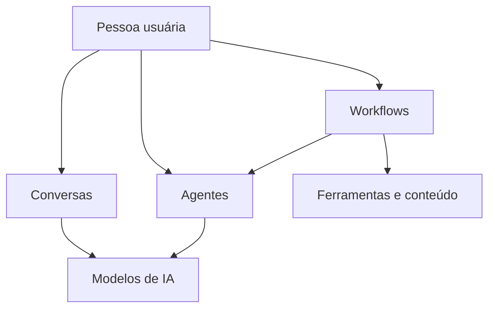

# 🜂 Osíris

### Plataforma de Gerenciamento de Inteligência Artificial

**Uma experiência única para conversar, criar, automatizar e explorar a IA com mais autonomia e controle.**

[Visão geral](#visao-geral) · [Funcionalidades](#funcionalidades) · [Tecnologias](#tecnologias) · [Dados](#dados) · [Visão](#visao) · [Contato](#licenca-e-contato)

> [!IMPORTANT]
> O Osíris está em desenvolvimento ativo. O projeto evolui continuamente para tornar o uso de IA mais privado, integrado e acessível.

## 📚 Sumário

- [📌 Visão geral](#visao-geral)
- [🚀 Funcionalidades principais](#funcionalidades)
- [🛠️ Tecnologias](#tecnologias)
- [🗄️ Dados e organização](#dados)
- [🌌 Visão do produto](#visao)
- [📄 Licença e contato](#licenca-e-contato)

---

## 📌 Visão geral

O **Osíris** é uma plataforma de gerenciamento de Inteligência Artificial criada para reunir diferentes formas de interação com IA em um único ambiente. A proposta é simples: menos fragmentação, mais autonomia.

Com uma identidade visual escura, direta e sofisticada, o projeto aproxima pessoas de recursos como conversas inteligentes, modelos locais, agentes personalizados e automações visuais - sem perder de vista privacidade, liberdade de escolha e controle sobre a experiência.

> [!NOTE]
> O Osíris foi pensado para acompanhar diferentes perfis de uso: de quem quer conversar com IA no dia a dia a quem deseja montar fluxos mais avançados de trabalho.

---

## 🚀 Funcionalidades principais

| Experiência | O que o Osíris oferece |
| :-- | :-- |
| 💬 **Conversas inteligentes** | Um espaço central para interagir com modelos de IA e manter o contexto das conversas. |
| 🧠 **Modelos locais** | Possibilidades para explorar e gerenciar modelos executados na própria máquina. |
| 🤖 **Agentes personalizados** | Criação de assistentes com objetivos, instruções e capacidades próprias. |
| 🧩 **Workflows visuais** | Uma abordagem gráfica para organizar tarefas, nós e automações. |
| ⌨️ **Ferramentas de produtividade** | Recursos voltados a tornar o ambiente mais próximo do fluxo de trabalho do usuário. |
| 📱 **Experiência multiplataforma** | Concepção para web, desktop e mobile, respeitando o contexto de cada dispositivo. |

> [!TIP]
> A ideia central do produto é permitir que cada pessoa combine chat, ferramentas e automações do jeito que fizer sentido para a sua rotina.

---

## 🛠️ Tecnologias

| Área | Tecnologias |
| :-- | :-- |
| Interface | React, Tailwind CSS e Vite |
| Desktop | Electron |
| Mobile | React Native e Expo |
| Back-end | Node.js e Express |
| Dados | MySQL |
| IA local | Llama.cpp e modelos GGUF |
| Automação visual | React Flow |

Essas escolhas equilibram uma interface moderna com uma base preparada para experiências locais, multiplataforma e evolutivas.

---

## 🗄️ Dados e organização

O modelo de dados do Osíris foi pensado para manter as experiências organizadas sem perder flexibilidade. Em vez de expor detalhes internos, ele pode ser entendido por seis grandes áreas:

| Área | Finalidade |
| :-- | :-- |
| 👤 **Identidade** | Mantém perfis, preferências e permissões de forma organizada. |
| 💬 **Conversas** | Sustenta chats, mensagens e os contextos de interação. |
| 🧠 **Inteligência artificial** | Agrupa modelos, agentes e recursos necessários às experiências de IA. |
| 🧩 **Automação** | Conecta etapas e componentes em fluxos visuais. |
| 📁 **Conteúdo** | Apoia o relacionamento entre arquivos, interações e projetos. |
| 📊 **Evolução da experiência** | Permite compreender o uso do produto e aprimorar a jornada do usuário. |

> [!NOTE]
> A estrutura foi desenhada para crescer com o produto, preservando organização entre conversas, automações, recursos e preferências.

---

## 🌌 Visão do produto

O Osíris acredita que IA não precisa ser uma coleção de abas, serviços desconectados e experiências opacas. A plataforma busca oferecer um ambiente onde tecnologia avançada pareça clara, pessoal e utilizável.

- **Privacidade como princípio:** mais controle sobre onde e como a IA é utilizada.
- **Autonomia como escolha:** liberdade para combinar modelos, agentes e ferramentas.
- **Simplicidade como experiência:** recursos avançados apresentados de forma visual e compreensível.
- **Evolução contínua:** uma base aberta a novos fluxos, integrações e formas de criar.

> [!IMPORTANT]
> O foco do projeto não é apenas usar IA, mas criar uma relação mais consciente e produtiva com ela.

---

## 📄 Licença e contato

A licença do projeto será definida em uma próxima etapa.

Para ideias, dúvidas ou contribuições, use as [issues do repositório](https://github.com/kauanbgs/osiris/issues).

Feito com foco em **privacidade, autonomia e controle**.

[⬆ Voltar ao topo](#sumario)

